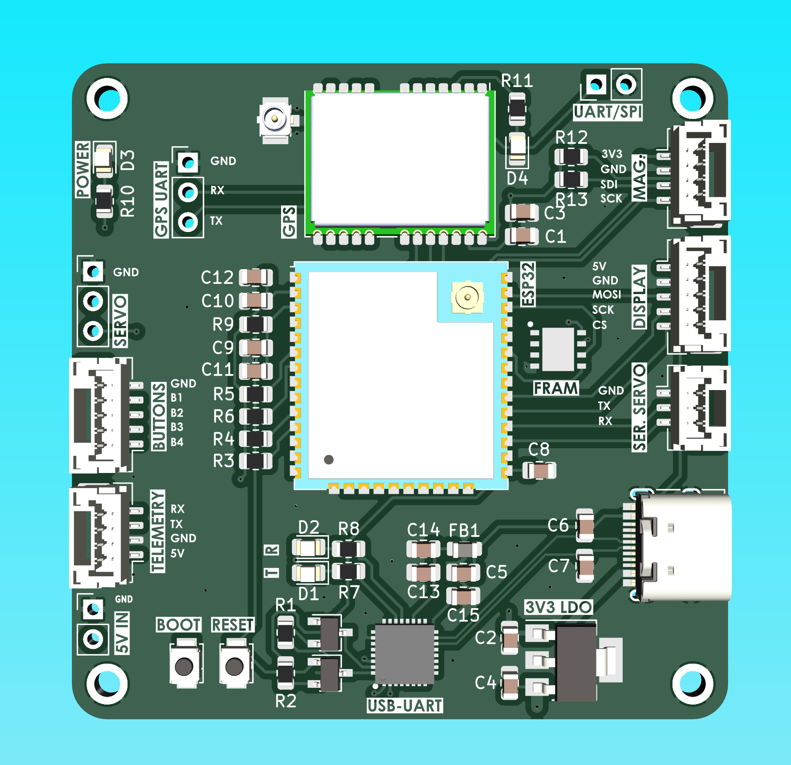
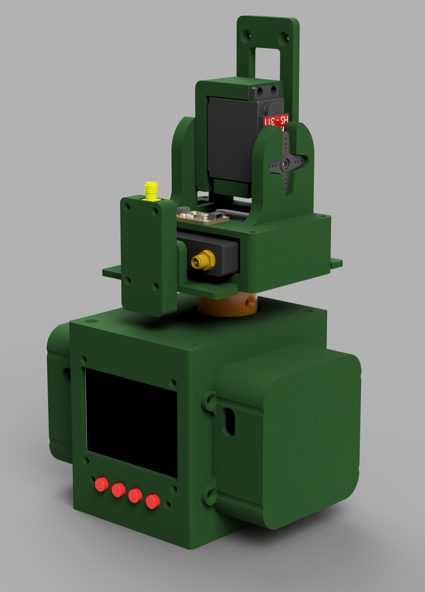

## Antenna tracker based on ESP32 microcontroller

This project focuses on the development of an antenna tracker with some ground station functionalities. Developed in platformio with Arduino framework. Based on [mLRS](https://github.com/olliw42/mLRS) project for MAVLink telemetry data.

### Contents of the repository
- `src` - source code of the project
- `schematic` - schematics and PCB design files
- `matlab_scripts` - magnetometer calibration routine

### Current features
- Tracking based on built-in GNSS receiver data and telemetry data from UAV
- 360° continuous rotation in vertical axis
- WiFi/BT/USB telemetry bridge
- Implemented magnetometer with calibration routine
### To be implemented
- GUI for configuration and monitoring on built-in display
- IMU pan and tilt stabilization
-
-
- More telemetry protocols

---

## Current PCB design

## Current mechanical design

